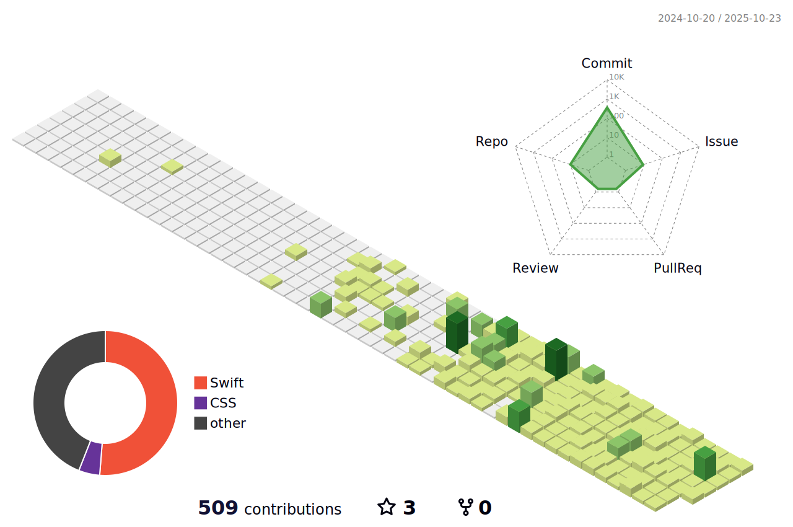

<meta name="viewport" content="width=device-width, initial-scale=1.0, minimum-scale=1.0">

---

## 김은찬 [Kim-eunchan]

"iOS Developer & UI/UX Designer"
#### Swift와 SwiftUI 기반의 iOS 앱 개발과 UIUX를 공부하고 있습니다

---

## 🧠 Skills

<table>
  <tr>
      
    
      
      
      
      
      
      
      
  </tr>
</table>

 

---

## 📖 Most used language

---

## 🏆 Baekjoon Solved rank

---

